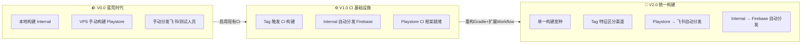
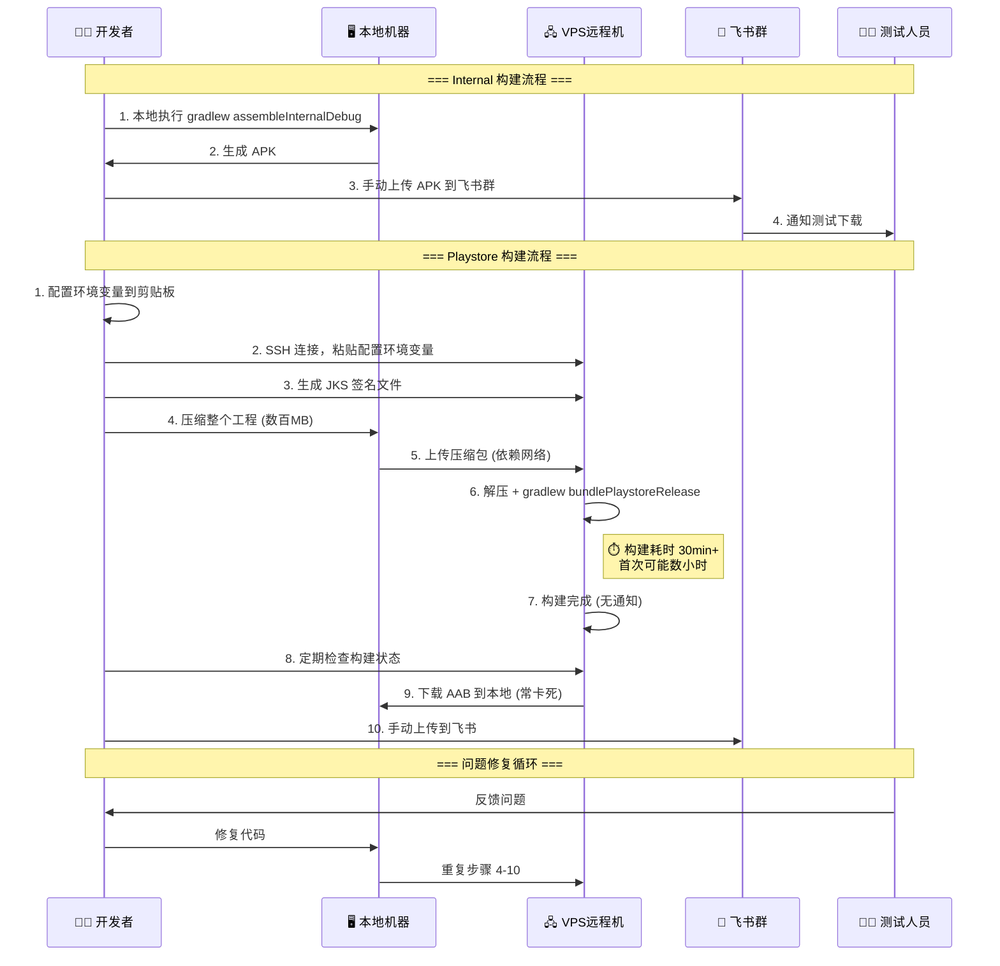
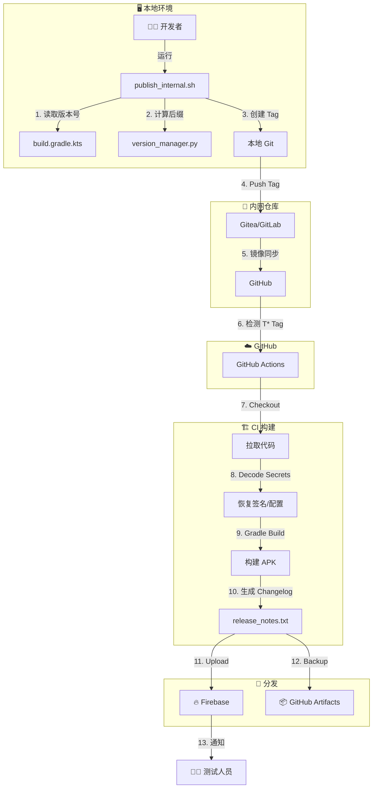
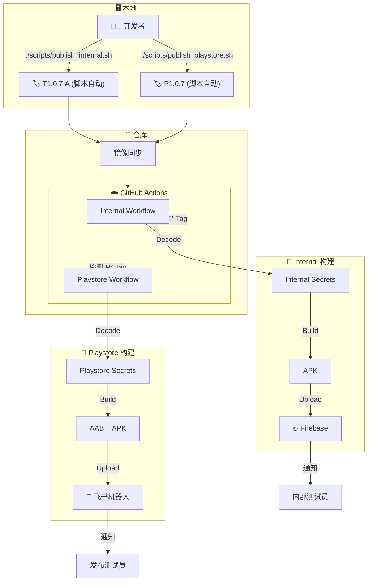

# 🚀 CI/CD 工作流演进路线图

> **文档目标**：从"蛮荒时代"到"现代化 DevOps"，实现研发到交付的全流程自动化。

---

## 📋 目录

1. [版本演进概览](#1-版本演进概览)
2. [Version 0.0 - 蛮荒时代 (当前实际使用)](#2-version-00---蛮荒时代-当前实际使用)
3. [Version 1.0 - CI 基础设施就绪 (已实现未启用)](#3-version-10---ci-基础设施就绪-已实现未启用)
4. [Version 2.0 - 统一构建 + 多渠道分发 (目标方案)](#4-version-20---统一构建--多渠道分发-目标方案)
5. [版本对比矩阵](#5-版本对比矩阵)
6. [风险评估与缓解策略](#6-风险评估与缓解策略)
   - 6.1 [Google Play 开发者账号关联风险评估](#61-️-google-play-开发者账号关联风险评估)
   - 6.2 [迁移风险](#62-迁移风险)
7. [实施路线图](#7-实施路线图)
8. [附录：可落地实施清单](#8-附录可落地实施清单)

---

## 1. 版本演进概览



| 版本    | 状态         | 核心特征             | 人工介入度 |
| ------- | ------------ | -------------------- | ---------- |
| **0.0** | 当前使用     | 全手动，依赖 VPS     | 🔴 100%     |
| **1.0** | 已实现未启用 | Internal CI 自动化   | 🟡 50%      |
| **2.0** | 目标方案     | 统一构建，全自动分发 | 🟢 5%       |

---

## 2. Version 0.0 - 蛮荒时代 (当前实际使用)

### 2.1 工作流程图



### 2.2 详细痛点分析

| 阶段         | 痛点描述                                     | 影响                    | 频率          |
| ------------ | -------------------------------------------- | ----------------------- | ------------- |
| **环境准备** | 每人/每台 VPS 都需手动配置环境变量、JDK、SDK | 首次配置耗时 2-4 小时   | 每人/每机一次 |
| **签名管理** | 在 VPS 上手动生成 JKS，密码记录混乱          | 签名不一致风险          | 每次换机      |
| **工程传输** | 压缩包数百 MB，上传/下载依赖网络             | 传输 10-30 分钟，常失败 | 每次构建      |
| **构建等待** | 无完成通知，需轮询检查状态                   | 无效等待 30min+         | 每次构建      |
| **产物回收** | 从 VPS 下载产物常无响应/卡死                 | 浪费时间，操作重复      | 每次构建      |
| **迭代循环** | 修复后需重复传输+构建流程                    | 单次迭代 1-2 小时       | 每次修复      |
| **多人协作** | VPS 环境被破坏，难以排查                     | 环境恢复耗时数小时      | 不定期        |
| **配置泄露** | 两套配置(internal/playstore)，敏感文件易提交 | 安全风险                | 持续存在      |
| **学习成本** | 每位开发需熟悉两套构建流程                   | 新人上手周期长          | 持续存在      |

### 2.3 优点

| 项目       | 说明                                |
| ---------- | ----------------------------------- |
| **可控性** | 完全人工控制，出问题可直接介入      |
| **零依赖** | 不依赖外部 CI 服务，无账号/配额限制 |
| **灵活性** | 可临时调整构建参数，适应紧急需求    |

### 2.4 风险点

| 风险             | 等级 | 描述                                 |
| ---------------- | ---- | ------------------------------------ |
| **签名泄露**     | 🔴 高 | Playstore 签名文件分散存储于多个 VPS |
| **构建不可复现** | 🔴 高 | 环境差异导致同代码构建结果不一致     |
| **人为失误**     | 🟡 中 | 手动操作多，易遗漏步骤或配置错误     |
| **知识孤岛**     | 🟡 中 | 流程依赖个人经验，无标准化文档       |

---

## 3. Version 1.0 - CI 基础设施就绪 (已实现未启用)

> **参考文档**: [`docs/CI_WORKFLOW_GUIDE.md`](./CI_WORKFLOW_GUIDE.md)

### 3.1 架构概览



### 3.2 已实现能力

| 能力               | 状态                   | 实现位置                           |
| ------------------ | ---------------------- | ---------------------------------- |
| **Internal 构建**  | ✅ 完整                 | `.github/workflows/android_ci.yml` |
| **Playstore 构建** | ✅ 框架就绪             | 同上 (需配置 Secrets)              |
| **Tag 触发**       | ✅ 支持 `T*`/`v*`       | Workflow trigger                   |
| **版本自增**       | ✅ Bijective Base-26    | `scripts/version_manager.py`       |
| **Changelog 生成** | ✅ Conventional Commits | `scripts/generate_changelog.py`    |
| **Firebase 分发**  | ✅ Internal 产物        | Workflow step                      |
| **Secrets 管理**   | ✅ 签名/配置外置        | GitHub Secrets                     |

### 3.3 未启用原因分析

| 原因                      | 详情                                           |
| ------------------------- | ---------------------------------------------- |
| **GitHub Secrets 未配置** | Internal/Playstore 的签名、Firebase 凭据未上传 |
| **镜像同步未配置**        | 内网仓库未开启到 GitHub 的 Push Mirror         |
| **习惯惯性**              | 团队仍沿用旧流程，未切换到新流程               |
| **Playstore 分发缺失**    | 仅支持 Firebase，未集成飞书                    |

### 3.4 1.0 版本优点

| 项目           | 说明                              |
| -------------- | --------------------------------- |
| **环境一致性** | CI 环境标准化，构建可复现         |
| **自动化**     | Tag 驱动，减少人工操作            |
| **安全性**     | 签名文件不入库，通过 Secrets 管理 |
| **可追溯**     | 每次构建有 Artifacts 归档         |
| **通知闭环**   | Firebase 自动通知测试人员         |

### 3.5 1.0 版本局限

| 局限                 | 影响                                     |
| -------------------- | ---------------------------------------- |
| **两套 Flavor**      | 仍需维护 `internal`/`playstore` 两套配置 |
| **Playstore 无分发** | 构建产物需手动下载再分发                 |
| **飞书未集成**       | 无法直接推送到飞书群                     |

### 3.6 风险点

| 风险             | 等级 | 描述                         |
| ---------------- | ---- | ---------------------------- |
| **Secrets 泄露** | 🟡 中 | 需正确配置 GitHub 仓库权限   |
| **CI 服务中断**  | 🟡 中 | 依赖 GitHub Actions 可用性   |
| **镜像延迟**     | 🟢 低 | 内网到 GitHub 同步可能有延迟 |

---

## 4. Version 2.0 - 统一构建 + 多渠道分发 (目标方案)

### 4.1 核心设计理念

```
┌─────────────────────────────────────────────────────────────────┐
│                     代码库零敏感信息                              │
│  • 不存放任何 Playstore 变种配置                                  │
│  • 签名、API Key 全部外置到 CI Secrets                           │
│  • 统一构建变种，运行时注入渠道差异                                │
└─────────────────────────────────────────────────────────────────┘
                              ↓
┌─────────────────────────────────────────────────────────────────┐
│                     Tag 驱动渠道识别                              │
│  • T* Tag → Internal 构建 → Firebase 分发                        │
│  • P* Tag → Playstore 构建 → 飞书分发                            │
│  • 同一套代码，不同 Tag 触发不同流水线                             │
└─────────────────────────────────────────────────────────────────┘
                              ↓
┌─────────────────────────────────────────────────────────────────┐
│                     全自动化闭环                                  │
│  • 开发者仅需：运行发布脚本 (脚本自动完成 tag + push)              │
│  • CI 自动：构建 → 签名 → 分发 → 通知                            │
│  • 人工介入：仅在异常时                                           │
│  • ⚠️ 严禁手动 git tag / git push，必须通过脚本触发               │
└─────────────────────────────────────────────────────────────────┘
```

### 4.2 目标架构图



### 4.3 Gradle 配置重构方案

#### 方案 A：保留单一 Flavor + 运行时注入 (推荐)

```kotlin
// app/build.gradle.kts

android {
    // 移除 playstore flavor，仅保留 release 配置
    // 通过 CI 环境变量注入差异化配置
    
    defaultConfig {
        // 基础包名，CI 可通过参数覆盖
        applicationId = System.getenv("APP_ID") 
            ?: "com.daily.health.manager"
        
        versionCode = 7
        versionName = project.findProperty("versionName") as? String 
            ?: "1.0.7"
    }
    
    // 统一使用 release 构建类型
    buildTypes {
        release {
            isShrinkResources = true
            isMinifyEnabled = true
            // 签名配置从 CI Secrets 注入
            signingConfig = signingConfigs.getByName("release")
        }
    }
    
    // 签名配置：优先读取环境变量，fallback 到本地配置
    signingConfigs {
        create("release") {
            storeFile = file(System.getenv("KEYSTORE_PATH") ?: "debug.keystore")
            storePassword = System.getenv("KEYSTORE_PASSWORD") ?: ""
            keyAlias = System.getenv("KEY_ALIAS") ?: ""
            keyPassword = System.getenv("KEY_PASSWORD") ?: ""
        }
    }
}
```

#### 方案 B：保留 Flavor 但配置外置

```kotlin
// 仍保留 internal/playstore flavor
// 但所有敏感配置通过环境变量注入
// 本地开发使用 internal，CI 根据 Tag 选择对应 flavor
```

**推荐方案 A**，原因：
- 代码库更简洁
- 减少维护成本
- 符合"统一构建变种"的目标

### 4.4 Tag 命名与触发规范 (Automated Tagging)

**核心原则**: 严禁开发者手动创建/推送 Tag。所有 Tag 均由脚本在检查环境无误后自动生成。

| 场景         | 开发者操作               | 脚本行为                                  | Tag 格式                               | 触发流程           |
| ------------ | ------------------------ | ----------------------------------------- | -------------------------------------- | ------------------ |
| **内网测试** | `./publish_internal.sh`  | 自动计算后缀 `Z`->`A_A` -> 打 Tag -> Push | `T{ver}.{suffix}` <br> (如 `T1.0.7.A`) | Internal Workflow  |
| **正式发布** | `./publish_playstore.sh` | 检查 Release 分支 -> 打 Tag -> Push       | `P{version}` <br> (如 `P1.0.7`)        | Playstore Workflow |

**为什么禁止手动 Tag?**
1.  **防止手误**: 脚本会校验 git 状态、分支是否正确。
2.  **版本连贯**: 脚本负责计算下一个可用版本，避免跳号或冲突。
3.  **触发校验**: 脚本确保 Tag 被推送到正确的远程仓库，从而触发 CI。

### 4.5 飞书分发集成方案

#### 方案 A：飞书 Webhook (简单)

```yaml
# .github/workflows/playstore_release.yml (片段)

- name: Upload to Feishu
  env:
    FEISHU_WEBHOOK: ${{ secrets.FEISHU_WEBHOOK_URL }}
  run: |
    # 上传文件到临时存储 (如 GitHub Artifacts URL 或其他)
    DOWNLOAD_URL="https://github.com/${{ github.repository }}/actions/runs/${{ github.run_id }}"
    
    # 发送飞书卡片消息
    curl -X POST "$FEISHU_WEBHOOK" \
      -H "Content-Type: application/json" \
      -d '{
        "msg_type": "interactive",
        "card": {
          "header": {
            "title": { "tag": "plain_text", "content": "🚀 Playstore 构建完成" },
            "template": "green"
          },
          "elements": [
            {
              "tag": "div",
              "text": { "tag": "lark_md", "content": "**版本**: '"${{ env.TAG_NAME }}"'\n**下载**: [点击获取]('"$DOWNLOAD_URL"')" }
            }
          ]
        }
      }'
```

#### 方案 B：飞书机器人 API (完整)

```yaml
# 需要配置飞书开放平台应用
# 支持直接上传文件到群聊

- name: Upload AAB to Feishu
  env:
    FEISHU_APP_ID: ${{ secrets.FEISHU_APP_ID }}
    FEISHU_APP_SECRET: ${{ secrets.FEISHU_APP_SECRET }}
    FEISHU_CHAT_ID: ${{ secrets.FEISHU_CHAT_ID }}
  run: |
    # 1. 获取 tenant_access_token
    TOKEN=$(curl -s -X POST "https://open.feishu.cn/open-apis/auth/v3/tenant_access_token/internal" \
      -H "Content-Type: application/json" \
      -d '{"app_id":"'"$FEISHU_APP_ID"'","app_secret":"'"$FEISHU_APP_SECRET"'"}' | jq -r '.tenant_access_token')
    
    # 2. 上传文件
    FILE_KEY=$(curl -s -X POST "https://open.feishu.cn/open-apis/im/v1/files" \
      -H "Authorization: Bearer $TOKEN" \
      -F "file_type=stream" \
      -F "file_name=app-release.aab" \
      -F "file=@app/build/outputs/bundle/release/app-release.aab" | jq -r '.data.file_key')
    
    # 3. 发送文件消息到群
    curl -X POST "https://open.feishu.cn/open-apis/im/v1/messages?receive_id_type=chat_id" \
      -H "Authorization: Bearer $TOKEN" \
      -H "Content-Type: application/json" \
      -d '{"receive_id":"'"$FEISHU_CHAT_ID"'","msg_type":"file","content":"{\"file_key\":\"'"$FILE_KEY"'\"}"}'
```

### 4.6 2.0 版本优点

| 项目             | 说明                                       |
| ---------------- | ------------------------------------------ |
| **零本地构建**   | 开发者仅需运行发布脚本，无需本地构建发布包 |
| **零 VPS 依赖**  | 彻底告别 VPS 手动流程                      |
| **零敏感信息**   | 代码库无任何签名/密钥文件                  |
| **统一构建变种** | 一套代码，Tag 驱动渠道差异                 |
| **全自动分发**   | Firebase/飞书自动推送，无人工介入          |
| **构建可追溯**   | 每次构建有完整日志和产物归档               |
| **新人友好**     | 标准化流程，无需学习复杂配置               |

### 4.7 2.0 版本局限

| 局限              | 缓解措施                             |
| ----------------- | ------------------------------------ |
| **CI 服务依赖**   | 保留 `publish_local.sh` 作为应急备用 |
| **网络依赖**      | GitHub Actions 有 SLA 保障           |
| **飞书 API 限制** | 文件大小限制 100MB，AAB 一般在限制内 |

### 4.8 风险点

| 风险                 | 等级 | 缓解策略                                        |
| -------------------- | ---- | ----------------------------------------------- |
| **Secrets 配置错误** | 🟡 中 | 提供 `generate_ci_secrets_helper.sh` 自动化工具 |
| **Tag 命名冲突**     | 🟢 低 | 脚本自动计算下一个可用 Tag                      |
| **飞书 API 变更**    | 🟢 低 | 封装为独立脚本，便于维护                        |
| **构建失败无感知**   | 🟢 低 | GitHub Actions 失败通知 + 飞书 Webhook 告警     |

---

### 4.9 关键技术实现细节

#### A. 动态配置注入 (Dynamic Config Injection)

为了实现“代码库零敏感信息”，我们引入 `scripts/inject_config.sh` 脚本，在构建前动态生成 `app/src/internal/config.gradle`。

*   **Internal 模式**: 解码 GitHub Secret `INTERNAL_CONFIG_BASE64`。
*   **Playstore 模式**: 通过 `curl` 下载远程配置 (URL 由 Secret 提供)，或解码 `PLAYSTORE_CONFIG_BASE64`。

#### B. 飞书上传机器人 (Lark Uploader)

不再依赖简单的 Webhook，而是使用飞书开放平台 API 实现大文件分发。
*   **脚本**: `scripts/lark_publisher.py`
*   **功能**:
    1.  使用 AppID/Secret 获取 Token。
    2.  上传 APK/AAB 到飞书云容器。
    3.  发送富文本卡片消息（含下载按钮）。

#### C. AI 辅助自动化测试 (AI Guided Testing)

集成 Firebase App Distribution 后，我们将免费获得 Google 的 AI 测试能力：
*   **自动遍历**: 每次内网构建 (`T*`) 上传后，Robo 脚本会自动安装运行，检测启动崩溃和核心路径。
*   **AI 引导**: 支持使用自然语言（如 *"Login as test/1234"*）指导机器人执行特定测试用例。
*   **价值**: 在测试人员介入前，构建系统已自动完成了一轮"冒烟测试"。

---

## 5. 版本对比矩阵

| 维度               | V0.0 蛮荒时代           | V1.0 CI 基础           | V2.0 统一构建 (目标)     |
| ------------------ | ----------------------- | ---------------------- | ------------------------ |
| **构建触发**       | 人工登录 VPS 敲命令     | Tag 触发               | Tag 触发                 |
| **Playstore 构建** | 远程机手动操作 (30min+) | CI 自动 (需配置)       | **CI 自动 + 远程注入**   |
| **Playstore 分发** | 手动拷贝 -> 手动发群    | 手动下载 Artifacts     | **飞书机器人自动推送**   |
| **代码库敏感度**   | 高 (含 JKS/Keys)        | 中 (可能残留)          | **零敏感 (Zero-Config)** |
| **构建变种**       | 维护两套 Flavor (割裂)  | 两套 Flavor            | **统一 Release 变种**    |
| **人工介入**       | 🔴 100% (全流程值守)     | 🟡 50% (需人肉搬运产物) | 🟢 **5% (仅需运行脚本)**  |

---

## 6. 风险评估与缓解策略

### 6.1 ⚠️ Google Play 开发者账号关联风险评估

使用公共 CI 服务（如 GitHub Actions）构建 Playstore 发布包时，存在潜在的**开发者账号关联风险**。Google 可能通过多种信号识别"关联账号"，若某账号被封禁，关联账号也可能受到牵连。

#### 风险信号分析

| 信号类型                | GitHub Actions 环境 | 风险等级 | 说明                                      |
| ----------------------- | ------------------- | -------- | ----------------------------------------- |
| **构建机器 IP**         | 共享 IP 池          | 🟡 中     | GitHub 使用 Azure/AWS 公共 IP，多租户共享 |
| **设备指纹**            | 虚拟机无固定指纹    | 🟢 低     | 每次构建使用全新临时 VM                   |
| **签名证书**            | 独立 (来自 Secrets) | 🟢 低     | 每个项目使用独立签名，不会关联            |
| **Google 账号登录**     | 无                  | 🟢 低     | CI 不登录 Google 账号                     |
| **Play Console 操作**   | 手动上传            | 🟢 低     | AAB 由人工上传，非 CI 自动发布            |
| **应用代码/资源相似度** | 取决于项目          | 🟡 中     | 若多项目代码结构相似需注意                |

#### 核心结论

| 评估项                                       | 结论                                                                                                                                              |
| -------------------------------------------- | ------------------------------------------------------------------------------------------------------------------------------------------------- |
| **GitHub Actions 构建 AAB 是否有关联风险？** | 🟢 **风险可控**。关键信号（签名证书、Play Console 账号、上传 IP）均独立                                                                            |
| **为什么风险可控？**                         | 1. 签名证书独立存储于 Secrets，每项目不同<br>2. CI 仅产出 AAB 文件，**不自动发布到 Play Store**<br>3. 最终上传由开发者在**本地/独立网络**手动完成 |
| **最大风险点**                               | 若未来启用 CI 自动发布 (通过 Play Publisher API)，则 API Key 和上传 IP 会成为关联信号                                                             |

#### 缓解策略

| 策略                   | 实施方式                                          | 效果                               |
| ---------------------- | ------------------------------------------------- | ---------------------------------- |
| **AAB 仅构建不发布**   | CI 产出 AAB 后分发到飞书，由人工上传 Play Console | ✅ 切断 CI 与 Play Store 的直接关联 |
| **独立签名证书**       | 每个 Play 账号/应用使用独立 JKS                   | ✅ 签名不关联                       |
| **上传使用独立网络**   | 上传 Play Store 时使用独立 IP (非公司网络)        | ✅ 避免 IP 关联                     |
| **避免 CI 自动发布**   | 不使用 `gradle-play-publisher` 等自动发布插件     | ✅ 最安全策略                       |
| **Self-hosted Runner** | (可选) 使用自建 Runner 获得固定/独立 IP           | 🟡 增加维护成本                     |

#### 不建议的做法

| 做法                                      | 风险                          |
| ----------------------------------------- | ----------------------------- |
| ❌ CI 直接调用 Play Publisher API 自动发布 | API Key + IP 可能成为关联信号 |
| ❌ 多个 Play 账号使用同一签名证书          | 强关联信号                    |
| ❌ 同一网络环境登录多个 Play Console       | IP 关联风险                   |

---

### 6.2 迁移风险

| 风险               | 概率 | 影响 | 缓解策略                                                   |
| ------------------ | ---- | ---- | ---------------------------------------------------------- |
| **配置注入失败**   | 中   | 高   | 脚本增加 `pre-check`，本地提供 `mock_config.gradle` 供调试 |
| **AAB 签名不匹配** | 中   | 高   | 首次发布前进行 SHA-256 指纹比对                            |
| **飞书上传超时**   | 低   | 中   | 增加自动重试机制 (Retries)                                 |

---

## 7. 实施路线图 (Updated)

### Phase 1: 基础设施 (Day 1)
- [ ] 配置 GitHub Secrets (Internal Keys).
- [ ] 验证 `publish_internal.sh` -> Firebase 链路.

### Phase 2: 去配置化重构 (Day 2-3)
- [ ] **移除 Flavor**: 删除 `build.gradle.kts` 中的 `productFlavors`.
- [ ] **注入脚本**: 开发 `scripts/inject_config.sh`.
- [ ] **CI 改造**: 修改 Workflow 适配 Tag 分流 (`T*` vs `P*`).

### Phase 3: Playstore 链路 (Day 4-5)
- [ ] **飞书集成**: 开发 `lark_publisher.py` 并配置 Secrets.
- [ ] **远程配置**: 准备 Playstore 专用的 Base64 配置或远程 URL.
- [ ] **全链路测试**: 模拟发布 `P1.0.0` 版本。

---

## 8. 附录：可落地实施清单

*(保持原有的 Secrets 清单，增加以下项)*

| Secret Name               | 用途                                   |
| ------------------------- | -------------------------------------- |
| `PLAYSTORE_CONFIG_BASE64` | Playstore 版 `config.gradle` 的 Base64 |
| `REMOTE_CONFIG_URL`       | (可选) 远程配置文件的下载 URL          |
| `LARK_APP_ID`             | 飞书应用 ID                            |
| `LARK_APP_SECRET`         | 飞书应用 Secret                        |
