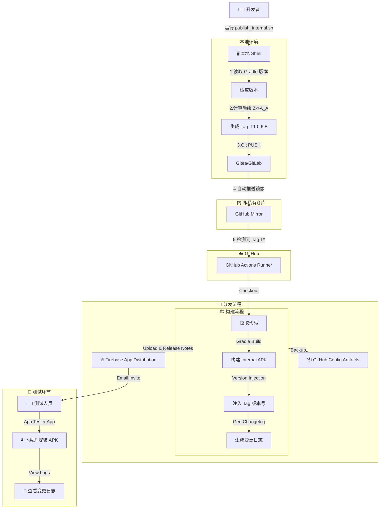

# ⚠️ [已废弃] Internal CI/CD 工作流集成指南

> **本文档已废弃，请使用新版：[CI_WORKFLOW_GUIDE_V2.md](./CI_WORKFLOW_GUIDE_V2.md)**
>
> 新版文档覆盖了零变体三层 Shifter 架构，包含详细的分步改造操作指南。

---

*以下为旧版内容，仅供历史参考：*

本文档详细描述了项目的自动化发布与构建流程。该流程实现了从本地脚本触发、多版本自增、自动镜像同步到 GitHub Actions 构建产出的全闭环。

---

## 1. 🌐 工作流架构图 (Workflow)



---

## 2. 🛠 基建与镜像配置 (Infrastructure)

### 2.1 镜像同步配置 (Mirroring)
由于 CI 运行在 GitHub，我们需要配置内网仓库（Gitea/GitLab）自动将代码 Push 到 GitHub。

**配置路径**: 仓库设置 (Repository Settings) -> **Mirror Settings** / **Push Mirrors**。

**参数填写指南**:
1.  **Repository URL**: 填写 GitHub 仓库的 HTTPS 地址。
    *   格式: `https://github.com/<User>/<Repo>.git`
2.  **Authorization (鉴权)**:
    *   **Username**: 您的 GitHub 用户名。
    *   **Password**: **⚠️ 重要**: 这里**不能**填写您的 GitHub 登录密码。必须填写 **Personal Access Token (PAT)**。

### 2.2 GitHub Secrets 详细配置指南
为了保护敏感信息（如签名文件），我们不能将其直接提交到代码仓库。CI 构建时，我们会从 GitHub Secrets 中通过 Base64 解码恢复这些文件。

由于本模版工程已经规范了目录结构 (`app/src/internal/`)，我们可以直接使用自动化脚本来完成配置。

#### 方案 A: 自动化配置 (推荐)
使用预置脚本 `scripts/generate_ci_secrets_helper.sh` 一键生成。

**操作步骤**:
1.  **运行助手**: 在项目根目执行 `./scripts/generate_ci_secrets_helper.sh`
2.  **查看输出**: 脚本会在终端显示 **密码**，并将 **Base64** 文件生成在 `build/secrets/` 目录。
3.  **填入 GitHub**: 进入 GitHub -> Settings -> Secrets and variables -> Actions -> New repository secret。

**必须配置的 Secrets 清单**:

| Secret Name (Key)                        | 填写内容 (Value)                                                |
| :--------------------------------------- | :-------------------------------------------------------------- |
| **INTERNAL_KEYSTORE_BASE64**             | `build/secrets/internal_keystore_base64.txt` 的内容             |
| **INTERNAL_GOOGLE_SERVICES_JSON_BASE64** | `build/secrets/internal_google_services_json_base64.txt` 的内容 |
| **INTERNAL_STORE_PASSWORD**              | Keystore 密码 (脚本输出中会显示)                                |
| **INTERNAL_KEY_ALIAS**                   | Key Alias (通常为 `key0`)                                       |
| **INTERNAL_KEY_PASSWORD**                | Key 密码                                                        |

#### 方案 B: 手动配置 (备选)
如果您不想使用脚本，也可以手动通过 Base64 命令生成。

**第一步：生成 Base64 字符串**
在本地终端执行以下命令 (Mac/Linux)：

```bash
# 1. 生成 Keystore 的 Base64 并复制到剪贴板 (Mac)
base64 -i <path/to/your.jks> | pbcopy
# Linux 用户使用: base64 -w 0 <path/to/your.jks>

# 2. 生成 google-services.json 的 Base64
base64 -i <path/to/google-services.json> | pbcopy
```

**第二步：在 GitHub 添加 Secrets**
添加逻辑同上。

### 2.3 获取 Firebase Service Account 密钥 (Firebase Initial Setup)
为了让 CI 能够自动上传 APK 到 Firebase App Distribution，您需要提供一个具有权限的 Service Account Key (JSON 格式)。

**图文操作步骤**:

1.  **访问控制台**: 打开 [Google Cloud Console - Service Accounts 页面](https://console.cloud.google.com/iam-admin/serviceaccounts).
2.  **切换项目**: 在顶部栏选择您的 Firebase 项目 (项目名称通常与 Firebase Console 中一致)。
3.  **创建账号**:
    *   点击顶部 **"＋ 创建服务账号" (Create Service Account)**。
    *   **步骤 1**: 填写名称 (例如 `firebase-ci-uploader`)，点击"创建并继续"。
    *   **步骤 2 (最关键)**: 在"选择角色"中搜索并选择 **`Firebase App Distribution Admin`** (这是上传 APK 所需的最小权限)。
    *   **步骤 3**: 直接点击完成。
4.  **生成密钥**:
    *   在列表中找到刚创建的账号，点击右侧的三个点或直接点击账号邮箱进入详情。
    *   切换到 **"密钥" (Keys)** 选项卡。
    *   点击 **"添加密钥" (Add Key) -> "创建新密钥" (Create new key)**。
    *   选择 **JSON** 格式，点击创建。
5.  **保存文件**:
    *   浏览器会自动下载一个 `.json` 文件 (例如 `project-name-123456.json`)。
    *   将该文件重命名为 `google-services-json-key.json` 并放入 `app/src/internal/` (用于本地调试，请勿提交到 Git) 或使用 `generate_ci_secrets_helper.sh` 生成 CI Secret。

---

## 3. 📂 自动化脚本详解 (Script Reference)

本系统依赖于 `scripts/` 目录下的四个核心脚本，它们各司其职。

### 3.1 发布脚本对比: `publish_internal.sh` vs `publish_local.sh`

我们提供两套脚本以应对不同的发布场景：

| 特性       | `publish_internal.sh` (推荐)          | `publish_local.sh` (调试用) |
| :--------- | :------------------------------------ | :-------------------------- |
| **场景**   | **正式发包流程**                      | 本地快速验证 / CI 挂了急救  |
| **原理**   | 仅打 Tag 推送到远程，**触发 CI 构建** | **本地直接构建** APK 并上传 |
| **CI依懒** | 强依赖 (需配置 GitHub Secrets)        | 无依赖 (需本地有 Key)       |
| **耗时**   | 慢 (依赖排队与上传)                   | 快 (取决于本机性能)         |
| **产物**   | 稳定复现，有记录                      | 仅本地临时产出              |

**使用建议**:
*   日常开发与测试，请优先使用 `publish_internal.sh`，确保构建环境纯净且可追溯。
*   仅在本地修改了构建逻辑需要快速验证，或者 CI 服务不可用时，使用 `publish_local.sh`。

**命令示例**:
```bash
# 场景 A: 触发 CI 发布
./scripts/publish_internal.sh

# 场景 B: 本地直接构建并上传 (需保证本地有 google-services-json-key.json)
./scripts/publish_local.sh
```

### 3.2 版本计算引擎: `version_manager.py`
*   **功能**: 处理复杂的版本位递增算法。
*   **逻辑**: 实现了 **Bijective Base-26** 算法。
    *   输入 `latest_suffix='Z'`, 输出 `'A_A'`。
    *   输入 `latest_suffix='A'`, 输出 `'B'`。
*   **原因**: 相比简单的数字递增，这种命名方式 (Excel 列名风格) 可以在有限的长度内支持无限的版本迭代，且排序清晰。

### 3.3 变更日志生成器: `generate_changelog.py`
*   **功能**: 自动生成 Release Notes。
*   **运行环境**: 仅在 CI 环境中自动调用。
*   **逻辑**:
    1.  获取当前 Tag (e.g. `T1.0.6.B`)。
    2.  向前回溯找到 **上一个 Tag** (支持 `T*` 或 `v*`)。
    3.  执行 `git log prev..current`。
    4.  按 Conventional Commits 规范分类解析 commit message：
        *   `feat`: 新功能
        *   `fix`: 修复
        *   `perf`: 性能
        *   其他: 归类为 Misc。
    5.  生成 `release_notes.txt` 文件供 Artifact 上传使用。

### 3.4 密钥生成助手: `generate_ci_secrets_helper.sh`
*   **功能**: 本地辅助工具，用于快速准备 GitHub Secrets。
*   **适用性**: 专为本模版工程设计，自动读取 `app/src/internal/sign.properties`。
*   **逻辑**:
    1.  读取配置获取密钥路径和密码。
    2.  将 `.jks` 和 `json` 文件转换为 Base64 字符串。
    3.  将结果保存到 `build/secrets/` 临时目录。

---

## 4. 📦 分发与测试 (Distribution & Testing)

### 4.1 构建产物 (Artifacts)
每次 CI 构建成功后的产物会存储在两个地方：
1.  **GitHub Actions Artifacts**:
    *   **内容**: APK 文件 (`app-internalRelease-T*.apk`) + `release_notes.txt`。
    *   **用途**: 归档备份，或者非 Firebase 渠道的分发。
    *   **有效期**: 默认 90 天。
2.  **Firebase App Distribution**:
    *   **内容**: 可直接安装的 APK。
    *   **用途**: 测试人员下载安装。

### 4.2 变更日志 (Changelog)
变更日志会自动同步到 Firebase。
*   **展示位置**: 测试人员在其手机上的 **App Tester** 应用中，点击版本即可看到。
*   **格式**: 纯文本格式，包含 `【 Features 】` 等分类与 `➤` 列表项，并会显示构建时间。
*   **截断**: 为保证移动端体验，日志最多显示最近 20 条提交。

### 4.3 测试人员指南 (For Testers)
如何让测试同学获取安装包？

1.  **添加测试员**:
    *   在 Firebase Console -> App Distribution -> Testers & Groups 中，将测试人员邮箱加入 `internal-testers` 组。
2.  **接受邀请**:
    *   测试人员会收到一封邮件 "You've been invited to test..."。
    *   (Android 手机) 点击邮件中的 **"Get Started"**。
    *   按指引下载并安装 **Firebase App Tester** 应用。
3.  **下载版本**:
    *   打开 **App Tester** 应用，登录 Google 账号。
    *   即可看到项目列表及最新版本 `T1.0.7.A`，点击 **Download** 即可安装。
    *   *注: 需开启 "安装未知来源应用" 权限。*

---

## 4. 常见问题排查 (Troubleshooting)

### 🔴 错误一: "Refusing to allow... update workflow"
*   **现象**: 内网仓库显示镜像同步失败，错误信息包含 `workflow scope` 相关字样。
*   **原因**: 您使用的 GitHub Token (PAT) 权限不足。
*   **解决**: 重新生成 Token，务必勾选 **`workflow`** 权限。

### 🔴 错误二: "Authentication Failed"
*   **现象**: 同步失败，提示鉴权错误。
*   **解决**: Token 过期。请生成新 Token，并在镜像设置中**清空密码框**后重新粘贴。

### 🔴 错误三: Actions 页面看不到 Workflow 列表
*   **现象**: 推送了 Tag 但 CI 没反应，Acitons 页面找不到入口。
*   **原因**: GitHub 默认只展示默认分支 (`main`) 的 Workflow。
*   **解决**: 必须先将代码合并进 `main` 分支。

## 5. CI 优化细节

*   **版本注入**: `-PinternalVersionName` 覆盖机制，确保 App 内部版本号与 GitHub Tag 一致。
*   **产物重命名**: 生成 `app-internalRelease-T1.0.6.B.zip`。
*   **构建缓存**: 采用 `gradle/actions/setup-gradle@v4`。
