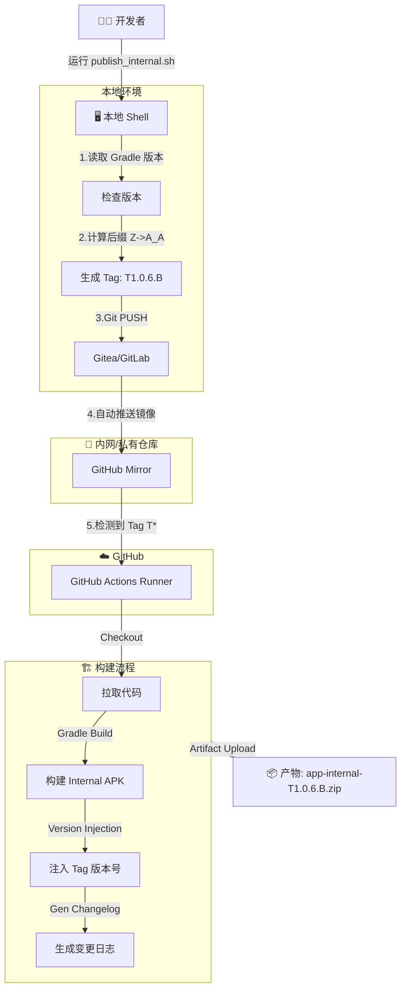
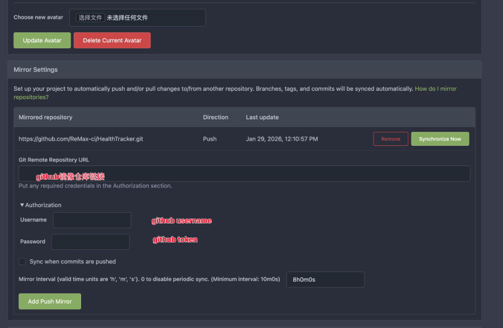
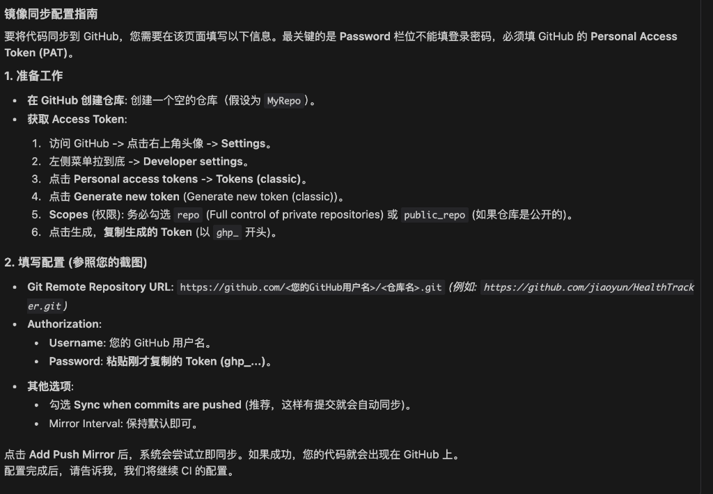
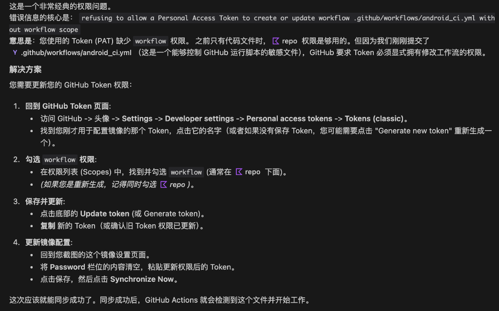
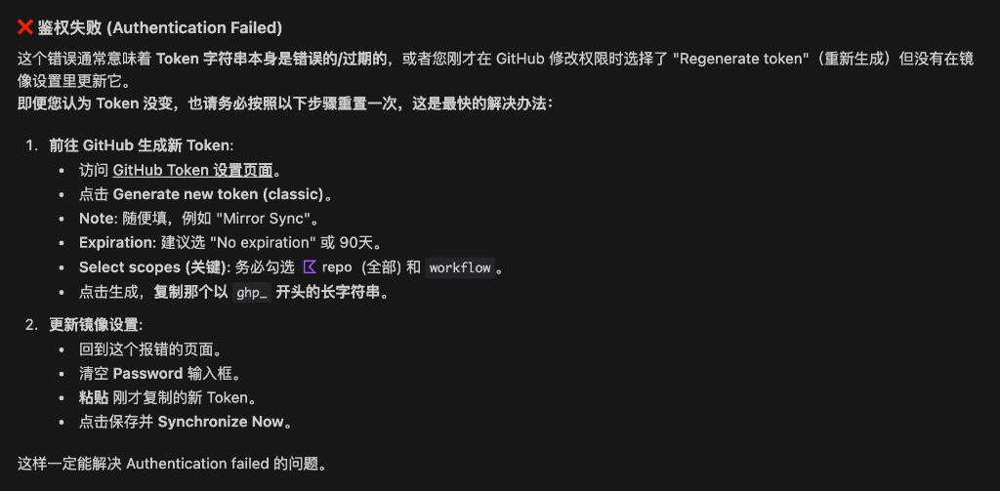
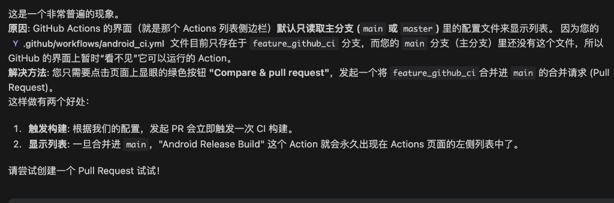

# 🚀 Internal CI/CD 工作流集成指南

本文档详细描述了项目的自动化发布与构建流程。该流程实现了从本地脚本触发、多版本自增、自动镜像同步到 GitHub Actions 构建产出的全闭环。

---

## 1. 🌐 工作流架构图 (Workflow)

---

## 2. 🛠 基建与镜像配置 (Infrastructure)

### 2.1 镜像同步 (Mirroring)
由于 CI 运行在 GitHub，我们需要主仓库（内网）自动把代码同步过去。
**操作位置**: Gitea/GitLab 仓库设置 -> `Mirror Settings`。

#### 关键配置项
*   **Repository URL**: `https://github.com/<User>/<Repo>.git` (例如 `https://github.com/my-org/my-project.git`)
*   **Authorization**:
    *   **Username**: 您的 GitHub 用户名
    *   **Password**: **注意！这里必须填 Personal Access Token (PAT)，绝对不能填登录密码**。

### 2.2 GitHub Secrets
文件不直接提交代码库，而是通过 GitHub Secrets注入。
*   `INTERNAL_KEYSTORE_BASE64`: `.jks` 文件的 Base64。
*   `INTERNAL_GOOGLE_SERVICES_JSON_BASE64`: `google-services.json` 文件 Base64。
*   签名密码 Secrets (`..._PASSWORD` 等)。

---

## 3. 常见问题排查 (Troubleshooting)

### 🔴 问题一: "Refusing to allow... workflow"
**现象**: 镜像同步失败，错误日志提示 Token 缺少权限。
**原因**: 您生成的 GitHub Token 没有勾选 `workflow` 权限。GitHub 规定修改 `.github/workflows/` 目录需要此特殊权限。

**解决**:
1.  重新生成 Token。
2.  务必勾选 `repo` (全选) 和 `workflow`。
3.  在镜像设置里更新 Password。

---

### 🔴 问题二: "Authentication Failed"
**现象**: 镜像同步提示鉴权失败。
**原因**: 通常是因为 Token 过期，或者在 Update Token 时操作不当（GitLab/Gitea 有时需要点 "Remove" 然后重新添加，或者确保 "Password" 栏已完全清空重填）。

**解决**:
1.  生成新的 Token (Classic)，有效期建议设置 `No expiration` 或 90天。
2.  清空镜像配置的 Password 框，粘贴新 Token。
3.  点击 **Synchronize Now** 测试。

---

### 🔴 问题三: Actions 页面找不到构建列表
**现象**: 推送了代码或 Tag，但在 GitHub Actions 页面看不到 Workflow。
**原因**: GitHub Actions 默认只从 **默认分支 (main/master)** 读取配置。如果您的 `.github/workflows/android_ci.yml` 还在 `feature` 分支，GitHub 界面上是“看不见”的。

**解决**:
1.  发起 Pull Request，将 CI 代码合并到 `main`。
2.  一旦合并，Action 就会出现在列表侧边栏。
3.  此后，在任何分支打 Tag 都能正常触发。

---

## 4. 自动化脚本 (Scripts)

| 脚本                    | 描述                                                                  |
| :---------------------- | :-------------------------------------------------------------------- |
| `publish_internal.sh`   | 发布入口。自动检测版本 `1.0.x`，计算 Tag `Tx.x.x.A`，并 Push 到远程。 |
| `version_manager.py`    | 实现了 A-Z-A_A 的版本位递增算法。                                     |
| `generate_changelog.py` | 生成基于 Git Commit 的变更日志。                                      |

## 5. CI 优化细节

*   **Version Injection**: 通过 `-PinternalVersionName` 将 Tag (e.g. `T1.0.6.B`) 注入到 APK 的 `BuildConfig`，无需手动修改代码。
*   **Artifact Naming**: 产物自动命名为 `app-internalRelease-<Tag>.zip`。
*   **Setup Gradle v4**: 使用官方 Action 进行高效缓存。
