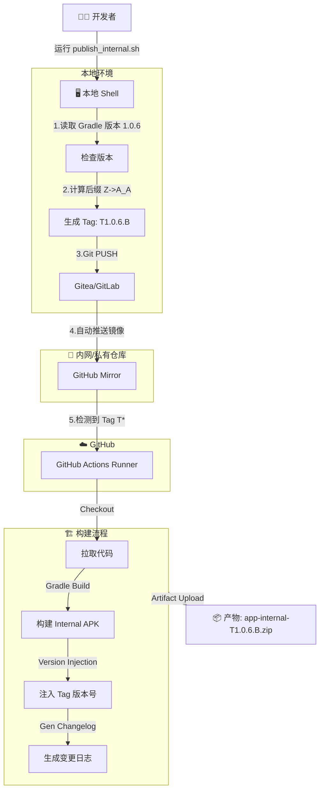

# 🚀 HealthTracker Internal CI/CD 工作流指南

本文档详细描述了 HealthTracker 项目的自动化发布与构建流程。该流程实现了从本地脚本触发、多版本自增、自动镜像同步到 GitHub Actions 构建产出的全闭环。

---

## 1. 🌐 工作流架构图 (Workflow)



---

## 2. 🛠 基础设施配置 (Infrastructure)

### 2.1 镜像同步 (Mirroring)
由于 CI 运行在 GitHub，我们需要主仓库（内网）自动把代码同步过去。
*   **位置**: Gitea/GitLab 仓库设置 -> `Mirror Settings`
*   **配置**:
    *   **Repository URL**: `https://github.com/ReMax-ci/HealthTracker.git`
    *   **Credentials**: 使用具有写权限的 GitHub Token (PAT)。
    *   **触发条件**: `Push` (确保 Tag 也能同步)。

### 2.2 GitHub Secrets (CI 密钥)
CI 构建需要签名文件 (`.jks`) 和 `google-services.json`，这些文件不直接提交到代码库，而是通过 Base64 编码存入 GitHub Secrets。

**必须配置的 Secrets**:
*   `INTERNAL_KEYSTORE_BASE64`: `app/src/internal/pdfreader.jks` 的 Base64 字符串。
*   `INTERNAL_GOOGLE_SERVICES_JSON_BASE64`: `app/src/internal/google-services.json` 的 Base64 字符串。
*   `INTERNAL_STORE_PASSWORD`, `INTERNAL_KEY_ALIAS`, `INTERNAL_KEY_PASSWORD`: 签名密码。

> 💡 **小贴士**: 也可以使用我们提供的辅助脚本 `scripts/generate_ci_secrets_helper.sh` 快速生成这些 Base64 字符串。

---

## 3. ⌨️ 自动化脚本体系 (Scripts)

位置: `./scripts/`

| 脚本名                      | 功能描述                          | 核心逻辑                                                                                                                                                                                          |
| :-------------------------- | :-------------------------------- | :------------------------------------------------------------------------------------------------------------------------------------------------------------------------------------------------ |
| **`publish_internal.sh`**   | **发布入口**。自动打 Tag 并推送。 | 1. 读取 `build.gradle.kts` 获取基准版本 (e.g., 1.0.6)。<br>2. 检索 Git 历史，找到当前版本最大的后缀 (e.g., T1.0.6.A)。<br>3. 调用 VersionManager 计算下一位。<br>4. 执行 `git tag` & `git push`。 |
| **`version_manager.py`**    | **版本计算引擎**。                | 实现了 **Bijective Base-26** 算法。支持 `A -> Z -> A_A -> A_B` 的无限递增逻辑，而非通过 ASCII 码简单处理。                                                                                        |
| **`generate_changelog.py`** | **日志生成器**。                  | 解析 **Conventional Commits** (feat, fix, perf)。<br>自动寻找 **上一个 Tag** (无论 T* 还是 v*) 计算增量差异。                                                                                     |

---

## 4. 🏗 CI 构建细节 (Configuration)

文件: `.github/workflows/android_ci.yml`

### 4.1 触发规则
仅当推送到 GitHub 的 Tag 符合以下规则时触发：
```yaml
on:
  push:
    tags:
      - "v*"  # 正式版
      - "T*"  # 内部测试版 (本次新增)
```

### 4.2 核心优化特性

#### A. 版本号注入 (Version Injection)
我们希望测试包的设置页显示 `T1.0.6.B`，而不是 `1.0.6-internal`。
*   **CI 层**: 提取 Tag 名称，作为参数传递：`./gradlew assemble ... -PinternalVersionName=T1.0.6.B`
*   **Gradle 层 (`app/build.gradle.kts`)**:
    ```kotlin
    create("internal") {
        if (project.hasProperty("internalVersionName")) {
             versionName = project.property("internalVersionName") as String
             versionNameSuffix = "" // 移除后缀，直接展示 Tag
        }
    }
    ```

#### B. 构建加速 (Caching)
使用官方 `gradle/actions/setup-gradle@v4` 替代旧版缓存，支持跨 Job 缓存共享和更智能的增量构建。
*   **全量构建**: ~20 mins (仅当 build.gradle 变更或缓存失效时)
*   **增量构建**: ~2 mins (常规发布)

#### C. 产物命名优化
构建产物会自动重命名，方便归档：
格式：`app-{variant}-{tag}.zip`
示例：**`app-internalRelease-T1.0.6.B.zip`**

---

## 5. 🚀 如何执行发布？

### 方法一: 使用 Antigravity Workflow (推荐)
在 Agent 对话框输入：
```
/publish-internal
```
Agent 会全自动执行脚本，带上 `--yes` 参数跳过确认。

### 方法二: 手动执行
在终端运行：
```bash
./scripts/publish_internal.sh
```
脚本会提示您确认新的版本号。

---

## 6. 常见问题 (FAQ)

**Q: 为什么生成的 Changelog 有时候特别长？**
A: 如果脚本找不到“上一个 Tag”（比如这是第一个 T 版本，且没有 v 版本），它会默认显示所有历史提交。现在的逻辑已经优化为查找任意 `T*` 或 `v*` Tag 作为基准。

**Q: 我在内网打的 Tag，GitHub 上没有？**
A: 请检查 Gitea/GitLab 的 Mirror Settings 里的 Last Update 时间，确保镜像同步正常工作。也可以手动在该页面点击 "Synchronize Now"。
