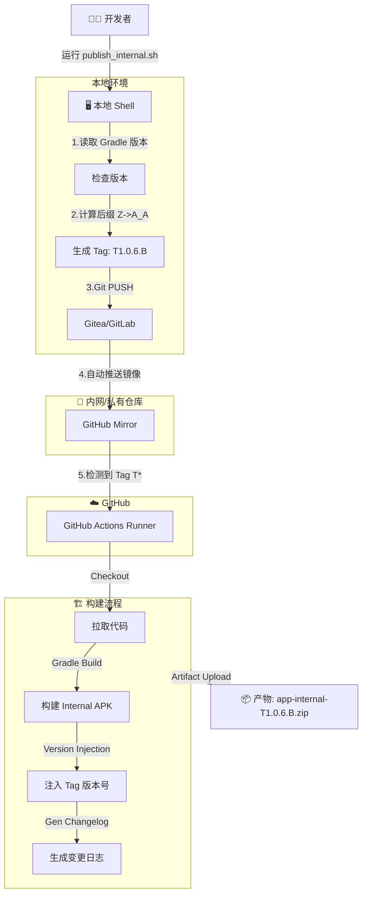

# 🚀 Internal CI/CD 工作流集成指南

本文档详细描述了项目的自动化发布与构建流程。该流程实现了从本地脚本触发、多版本自增、自动镜像同步到 GitHub Actions 构建产出的全闭环。

---

## 1. 🌐 工作流架构图 (Workflow)



---

## 2. 🛠 基建与镜像配置 (Infrastructure)

### 2.1 镜像同步配置 (Mirroring)
由于 CI 运行在 GitHub，我们需要配置内网仓库（Gitea/GitLab）自动将代码 Push 到 GitHub。

**配置路径**: 仓库设置 (Repository Settings) -> **Mirror Settings** / **Push Mirrors**。

**参数填写指南**:
1.  **Repository URL**: 填写 GitHub 仓库的 HTTPS 地址。
    *   格式: `https://github.com/<User>/<Repo>.git`
2.  **Authorization (鉴权)**:
    *   **Username**: 您的 GitHub 用户名。
    *   **Password**: **⚠️ 重要**: 这里**不能**填写您的 GitHub 登录密码。必须填写 **Personal Access Token (PAT)**。

### 2.2 GitHub Secrets 详细配置指南
为了保护敏感信息（如签名文件），我们不能将其直接提交到代码仓库。CI 构建时，我们会从 GitHub Secrets 中通过 Base64 解码恢复这些文件。

#### 第一步：准备 Base64 字符串
在本地终端执行以下命令，将文件转换为 Base64 字符串（以 macOS 为例）：

```bash
# 生成 Keystore 的 Base64
base64 -i app/your-keystore.jks | pbcopy
# (Linux 用户使用: base64 -w 0 app/your-keystore.jks)

# 生成 google-services.json 的 Base64
base64 -i app/google-services.json | pbcopy
```

#### 第二步：在 GitHub 添加 Secrets
1.  打开 GitHub 仓库页面。
2.  点击顶部导航栏的 **Settings** (设置)。
3.  在左侧侧边栏中找到 **Secrets and variables** -> 点击 **Actions**。
4.  点击右上角的绿色按钮 **New repository secret**。

#### 第三步：添加以下 Secret 条目
请依次添加以下 Key，Value 填入对应的内容：

| Secret Name (Key)                        | Value (内容描述)                                       |
| :--------------------------------------- | :----------------------------------------------------- |
| **INTERNAL_KEYSTORE_BASE64**             | 刚才生成的 `.jks` 文件的 Base64 完整字符串             |
| **INTERNAL_GOOGLE_SERVICES_JSON_BASE64** | 刚才生成的 `google-services.json` 的 Base64 完整字符串 |
| **INTERNAL_STORE_PASSWORD**              | Keystore 的 Store Password (明文)                      |
| **INTERNAL_KEY_ALIAS**                   | Key Alias (明文，例如 `key0`)                          |
| **INTERNAL_KEY_PASSWORD**                | Key Password (明文)                                    |

---

## 3. 常见问题排查 (Troubleshooting)

### 🔴 错误一: "Refusing to allow... update workflow"
*   **现象**: 内网仓库显示镜像同步失败，错误信息包含 `workflow scope` 相关字样。
*   **原因**: 您使用的 GitHub Token (PAT) 权限不足。GitHub 安全策略规定，修改 `.github/workflows/` 目录下的 CI 配置文件需要额外的权限。
*   **解决**:
    1.  重新生成 Token。
    2.  **关键步骤**: 在 Scopes 列表中，务必勾选 **`workflow`** (通常在 `repo` 选项下方)。
    3.  回到镜像设置，更新 Password 为新 Token。

### 🔴 错误二: "Authentication Failed"
*   **现象**: 同步失败，提示鉴权错误。
*   **原因**: Token 过期，或者配置更新未生效。
*   **解决**:
    1.  生成新的 Token (Classic)，建议有效期设为 *No expiration* (永久) 以免频繁维护。
    2.  **清空** 镜像设置里的 Password 框 (有些浏览器会通过记住密码自动填充旧的)，手动粘贴新 Token。
    3.  点击 **Synchronize Now** 进行测试。

### 🔴 错误三: Actions 页面看不到 Workflow 列表
*   **现象**: 推送了代码，但在 GitHub Actions 页面一片空白，左侧没有 Workflow 列表。
*   **原因**: GitHub 默认只读取 **默认分支 (main/master)** 的 CI 配置。如果您的配置文件只存在于 `feature` 分支，GitHub 界面上不可见。
*   **解决**:
    1.  必须先发起 Pull Request，将包含 `.github/workflows/` 的分支 **合并进 main**。
    2.  合并后，Actions 侧边栏即会出现。此后在任何分支打 Tag 均可触发。

---

## 4. 自动化脚本 (Scripts)

位置: `./scripts/`

| 脚本名                      | 功能                                                                                                        |
| :-------------------------- | :---------------------------------------------------------------------------------------------------------- |
| **`publish_internal.sh`**   | **发布入口**。自动识别 `app/build.gradle.kts` 版本，寻找历史 Tag，计算出下一位 Tag (如 `T1.0.6.B`) 并推送。 |
| **`version_manager.py`**    | **版本算法**。实现了 `Z` -> `A_A` 的特殊进位逻辑，确保版本号无限可扩展。                                    |
| **`generate_changelog.py`** | **日志生成**。基于两次 Tag 之间的 git commit 生成格式化的 Release Notes。                                   |

## 5. CI 优化细节

*   **版本注入 (Version Injection)**:
    *   CI 捕获 Tag 名 (e.g., `T1.0.6.B`)。
    *   通过 Gradle 参数 `-PinternalVersionName=T1.0.6.B` 传入。
    *   构建脚本会自动覆盖 `versionName`，确保 App 内显示的版本与 Tag 一致。
*   **产物重命名**:
    *   构建产物名为 `app-internalRelease-T1.0.6.B.zip`，便于归档和区分。
*   **构建缓存**:
    *   使用 `gradle/actions/setup-gradle@v4`，大幅提升非首次构建的速度。
