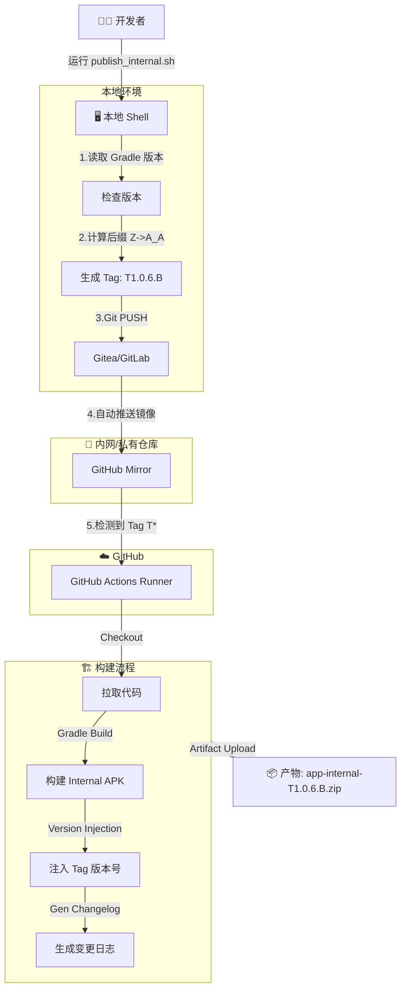

# 🚀 Internal CI/CD 工作流集成指南

本文档详细描述了项目的自动化发布与构建流程。该流程实现了从本地脚本触发、多版本自增、自动镜像同步到 GitHub Actions 构建产出的全闭环。

---

## 1. 🌐 工作流架构图 (Workflow)



---

## 2. 🛠 基建与镜像配置 (Infrastructure)

### 2.1 镜像同步配置 (Mirroring)
由于 CI 运行在 GitHub，我们需要配置内网仓库（Gitea/GitLab）自动将代码 Push 到 GitHub。

**配置路径**: 仓库设置 (Repository Settings) -> **Mirror Settings** / **Push Mirrors**。

**参数填写指南**:
1.  **Repository URL**: 填写 GitHub 仓库的 HTTPS 地址。
    *   格式: `https://github.com/<User>/<Repo>.git`
2.  **Authorization (鉴权)**:
    *   **Username**: 您的 GitHub 用户名。
    *   **Password**: **⚠️ 重要**: 这里**不能**填写您的 GitHub 登录密码。必须填写 **Personal Access Token (PAT)**。

### 2.2 GitHub Secrets 详细配置指南
### 2.2 GitHub Secrets 详细配置指南
为了保护敏感信息（如签名文件），我们不能将其直接提交到代码仓库。CI 构建时，我们会从 GitHub Secrets 中通过 Base64 解码恢复这些文件。

#### 方案 A: 通用手动配置 (适用于所有项目)
不依赖任何特定脚本，适用于任何 Android 工程结构。

**必须准备的素材**:
1.  签名文件 (例如 `your-key.jks`)
2.  Firebase 配置文件 (例如 `google-services.json`)
3.  签名密码信息

**第一步：生成 Base64 字符串**
在本地终端执行以下命令 (Mac/Linux)：

```bash
# 1. 生成 Keystore 的 Base64 并复制到剪贴板 (Mac)
base64 -i <path/to/your.jks> | pbcopy
# Linux 用户使用: base64 -w 0 <path/to/your.jks>

# 2. 生成 google-services.json 的 Base64
base64 -i <path/to/google-services.json> | pbcopy
```

**第二步：在 GitHub 添加 Secrets**
1.  GitHub -> **Settings** -> **Secrets and variables** -> **Actions** -> **New repository secret**。
2.  依次添加以下 5 个变量：

| Secret Name (Key)                        | Value (填写内容)                       |
| :--------------------------------------- | :------------------------------------- |
| **INTERNAL_KEYSTORE_BASE64**             | 粘贴刚才生成的 `.jks` Base64 长字符串  |
| **INTERNAL_GOOGLE_SERVICES_JSON_BASE64** | 粘贴刚才生成的 `.json` Base64 长字符串 |
| **INTERNAL_STORE_PASSWORD**              | Keystore 的 Store Password (明文)      |
| **INTERNAL_KEY_ALIAS**                   | Key Alias (明文，例如 `key0`)          |
| **INTERNAL_KEY_PASSWORD**                | Key Password (明文)                    |

#### 方案 B: 使用项目辅助脚本 (可选)
如果您的项目结构与本项目一致（通过 properties 管理签名），可以使用参考脚本 `scripts/generate_ci_secrets_helper.sh` 自动提取并生成上述内容。使用方法详见后文 **3.4 脚本详解**。

---

## 3. 📂 自动化脚本详解 (Script Reference)

本系统依赖于 `scripts/` 目录下的四个核心脚本，它们各司其职。

### 3.1 发布入口脚本: `publish_internal.sh`
*   **功能**: "一键发布" 的控制台工具。
*   **使用方式**:
    ```bash
    ./scripts/publish_internal.sh          # 交互模式 (需手动确认 Y)
    ./scripts/publish_internal.sh --yes    # 自动模式 (Antigravity Workflow 使用)
    ```
*   **核心逻辑**:
    1.  解析 `app/build.gradle.kts` 获取基准版本号 (如 `1.0.6`)。
    2.  `git tag -l` 检索当前所有 `T1.0.6.*` 的 Tag。
    3.  调用 `version_manager.py` 计算出最新的一位后缀 (如 `B`)。
    4.  执行 `git tag` 打标并 `git push` 给远程。

### 3.2 版本计算引擎: `version_manager.py`
*   **功能**: 处理复杂的版本位递增算法。
*   **逻辑**: 实现了 **Bijective Base-26** 算法。
    *   输入 `latest_suffix='Z'`, 输出 `'A_A'`。
    *   输入 `latest_suffix='A'`, 输出 `'B'`。
*   **原因**: 相比简单的数字递增，这种命名方式 (Excel 列名风格) 可以在有限的长度内支持无限的版本迭代，且排序清晰。

### 3.3 变更日志生成器: `generate_changelog.py`
*   **功能**: 自动生成 Release Notes。
*   **运行环境**: 仅在 CI 环境中自动调用。
*   **逻辑**:
    1.  获取当前 Tag (e.g. `T1.0.6.B`)。
    2.  向前回溯找到 **上一个 Tag** (支持 `T*` 或 `v*`)。
    3.  执行 `git log prev..current`。
    4.  按 Conventional Commits 规范分类解析 commit message：
        *   `feat`: 新功能
        *   `fix`: 修复
        *   `perf`: 性能
        *   其他: 归类为 Misc。
    5.  生成 `release_notes.txt` 文件供 Artifact 上传使用。

### 3.4 密钥生成助手: `generate_ci_secrets_helper.sh`
*   **功能**: 本地辅助工具，用于快速准备 GitHub Secrets。
*   **注意**: **本脚本是针对当前项目结构编写的参考实现**。
    *   默认逻辑：读取 `app/src/internal/sign.properties` 解析签名配置。
    *   **适配指南**: 如果其他项目的签名配置文件位置不同（例如在根目录 `local.properties` 或 `keystore.properties`），**请务必修改脚本中的 `PROP_FILE` 路径和解析逻辑** 以适配您的工程。
*   **逻辑**:
    1.  读取配置获取密钥路径和密码。
    2.  将 `.jks` 和 `json` 文件转换为 Base64 字符串。
    3.  将结果保存到 `build/secrets/` 临时目录。

---

## 4. 常见问题排查 (Troubleshooting)

### 🔴 错误一: "Refusing to allow... update workflow"
*   **现象**: 内网仓库显示镜像同步失败，错误信息包含 `workflow scope` 相关字样。
*   **原因**: 您使用的 GitHub Token (PAT) 权限不足。
*   **解决**: 重新生成 Token，务必勾选 **`workflow`** 权限。

### 🔴 错误二: "Authentication Failed"
*   **现象**: 同步失败，提示鉴权错误。
*   **解决**: Token 过期。请生成新 Token，并在镜像设置中**清空密码框**后重新粘贴。

### 🔴 错误三: Actions 页面看不到 Workflow 列表
*   **现象**: 推送了 Tag 但 CI 没反应，Acitons 页面找不到入口。
*   **原因**: GitHub 默认只展示默认分支 (`main`) 的 Workflow。
*   **解决**: 必须先将代码合并进 `main` 分支。

## 5. CI 优化细节

*   **版本注入**: `-PinternalVersionName` 覆盖机制，确保 App 内部版本号与 GitHub Tag 一致。
*   **产物重命名**: 生成 `app-internalRelease-T1.0.6.B.zip`。
*   **构建缓存**: 采用 `gradle/actions/setup-gradle@v4`。
