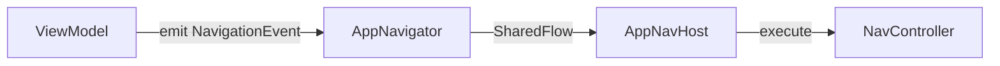

# CoolMallKotlin 项目架构与最佳实践指南

本项目是一个基于 **Jetpack Compose** 的现代 Android 电商应用参考实现，深度实践了 **Google Now in Android (NiA)** 的模块化方案与架构指南。本指南旨在总结本工程的核心架构特点，以便在其他工程中复用这些最佳实践。

---

## 1. 模块化方案 (Modularization)

项目采用了高度解耦的模块化结构，分为三层：

| 层次           | 模块前缀      | 职能描述                                                                                                                                  |
| :------------- | :------------ | :---------------------------------------------------------------------------------------------------------------------------------------- |
| **App 层**     | `:app`        | 入口模块，负责 Hilt 的单例初始化、AppNavigation 控制器配置、全局主题应用。                                                                |
| **Feature 层** | `:feature:*`  | 面向业务的功能模块（如 `:feature:goods`, `:feature:order`）。包含 UI、ViewModels 及导航定义。模块间禁止直接依赖，通过接口或消息驱动通信。 |
| **Core 层**    | `:core:*`     | 基础能力模块（如 `:core:network`, `:core:database`, `:core:designsystem`）。为 Feature 层提供原子化的公共服务。                           |
| **Navigation** | `:navigation` | 独立的导航管理模块，定义全局路由、拦截器及跨模块跳转逻辑。                                                                                |

---

## 2. 代码组织与划分准则 (Code Organization)

为了实现“高内聚、低耦合”，本项目遵循以下细粒度的代码组织准则：

### 2.1 Core 模块职责细分
Core 层的每一个子模块都有严格的边界，防止功能蔓延：

| 子模块               | 核心职责                  | 包含内容示例                                               |
| :------------------- | :------------------------ | :--------------------------------------------------------- |
| `:core:model`        | **全局基石**              | 纯 Kotlin 数据类，不含任何平台逻辑或 Android 依赖。        |
| `:core:network`      | **网络基础设施**          | Retrofit Service 接口、网络拦截器、RemoteDataSource 实现。 |
| `:core:database`     | **本地存储基础设施**      | Room Entity 实体、DAO 接口、AppDatabase 配置。             |
| `:core:datastore`    | **偏好设置**              | 基于 Proto DataStore 或 MMKV 的持久化 Key-Value 存储。     |
| `:core:data`         | **数据编排 (Repository)** | 业务逻辑中心，协调网络和本地数据源，对外暴露 Flow 数据流。 |
| `:core:designsystem` | **视觉原子**              | 颜色、字体、图标、形状及高度复用的基础 UI 组件。           |
| `:core:ui`           | **公共 UI 组件**          | 非设计系统的通用 UI 逻辑（如分页列表容器、状态页布局）。   |
| `:core:common`       | **通用工具**              | 协程调度器、日志工具、字符串处理等通用 Utility。           |

### 2.2 Feature 模块内部结构
Feature 模块内部遵循 **UDF (Unidirectional Data Flow)** 模式进行代码组织：

- **`view/`**：Compose 页面入口及复杂的页面级组件。
- **`viewmodel/`**：承载业务逻辑的 ViewModel，通过 Hilt 注入 Repository。
- **`state/`**：定义 UI State (data class) 和 UI Event (sealed interface)。
- **`navigation/`**：定义本模块的导航图 (NavGraph) 和目的地。
- **`component/`**：仅限本模块使用的 Compose 小组件。
- **`model/`**：仅限本模块使用的 UI 表现层模型。

> [!TIP]
> **原则**：如果一个组件在超过两个 Feature 中使用，应考虑将其下沉至 `:core:designsystem` 或 `:core:ui`。

---

## 3. 构建系统最佳实践 (Build System)

### 3.1 依赖管理 (Version Catalog)
使用 `gradle/libs.versions.toml` 统一管理版本，通过插件别名机制共享构建配置。
- **优势**：类型安全、IDE 自动补全、版本变更全局生效。

### 3.2 构建逻辑复用 (Convention Plugins)
在 `build-logic` 目录下定义了多个 Convention Plugins（如 `coolmall-android-feature`, `coolmall-hilt`）。
- **核心理念**：将复杂的构建配置（SDK 版本、Kotlin 配置、依赖组）封装在插件中，Feature 模块只需一行 `id` 引用即可完成配置，极大地降低了样板代码。

---

## 4. 技术栈选型 (Technology Stack)

- **UI 层**：100% Jetpack Compose，遵循 UDF (Unidirectional Data Flow) 模式。
- **导航**：Navigation Compose + `AppNavigator` 事件驱动系统。
- **网络**：Retrofit + OkHttp + Kotlinx Serialization。
- **存储**：MMKV (高性能 Key-Value) + Room (结构化数据库)。
- **DI**：Hilt (Dagger 的 Android 封装)。
- **其他**：Coil (图片加载), Timber (日志), XXPermissions (动态权限)。

---

## 5. 核心模式：AppNavigator 事件驱动导航

为了实现 ViewModel 与 NavController 的彻底解耦，项目实现了一套自定义的导航 system：



### 最佳实践点：
1. **类型安全路由**：使用 Kotlinx Serialization 标记路由类，支持 `navigateTo(GoodsRoutes.Detail(id = 123))` 这种直接传参方式。
2. **端到端结果回传**：通过自定义的 `NavigationResultKey` 实现了强类型的结果回传机制，避免了手动解析 Bundle 带来的隐患。
3. **导航拦截器**：在 `RouteInterceptor` 中统一处理登录拦截、AB 测试重定向等逻辑。

---

## 6. 设计系统 (Design System)

所有的 UI 规范统一收拢在 `:core:designsystem` 模块中：
- **Theme.kt**：定义动态配色与暗黑模式适配。
- **Type.kt / Size.kt**：统一定义字体阶梯与间距规范，禁止在业务模块中硬编码 `dp` 或 `sp`。
- **组件库**：提供高度复用的 `CoolMallTopAppBar`, `CoolMallButton` 等定制组件，确保全应用视觉一致性。

---

## 7. 代码建议与开发流程

1. **New Feature 流程**：
   - 在 `:feature` 下新建子模块。
   - 依赖 `coolmall-android-feature` 插件。
   - 在 `:navigation` 中定义路由类。
   - 在应用入口 `CoolMallNavHost` 中注册 `FeatureGraph`。
2. **单一数据源**：坚持 Repository 模式，UI 只通过 ViewModel 观察 `Flow` 数据，不直接触达数据层。
3. **资源处理**：所有的静态资源（图片、SVG）优先放在 `:core:designsystem` 或对应的 `:feature` 模块中，维持物理隔离。

---

## 8. 通用 UI 与动画最佳实践 (Common UI & Animations)

本节总结了项目中可直接复用的通用 UI 模式和动画配置，这些代码经过实践验证，具有高度的稳定性。

### 8.1 导航动画配置 (Navigation Animations)
在 `AppNavHost` 中，我们为全应用定义了统一的左右滑入/滑出动画，这能显著提升应用的平滑感。

```kotlin
NavHost(
    navController = navController,
    // ...
    enterTransition = {
        slideIntoContainer(
            towards = AnimatedContentTransitionScope.SlideDirection.Left,
            animationSpec = tween(300)
        )
    },
    exitTransition = {
        slideOutOfContainer(
            towards = AnimatedContentTransitionScope.SlideDirection.Left,
            animationSpec = tween(300)
        )
    },
    popEnterTransition = {
        slideIntoContainer(
            towards = AnimatedContentTransitionScope.SlideDirection.Right,
            animationSpec = tween(300)
        )
    },
    popExitTransition = {
        slideOutOfContainer(
            towards = AnimatedContentTransitionScope.SlideDirection.Right,
            animationSpec = tween(300)
        )
    }
)
```

### 8.2 通用对话框 (WeDialog)
我们实现了一套基于状态驱动的对话框系统，支持简单的 API 调用和完善的状态管理。

- **核心组件**：`WeDialog` (UI 展现层)。
- **状态管理**：`rememberDialogState()` (逻辑控制层)。

**使用示例**：
```kotlin
val dialogState = rememberDialogState()

// 在某个点击事件中
dialogState.show(
    title = "确认删除？",
    content = "删除后将无法恢复",
    onOk = { /* 处理删除逻辑 */ }
)
```

### 8.3 底部弹出层 (BottomModal)
针对移动端常用的底部 Modal，我们封装了 `BottomModal`，它具备以下优点：
1. **安全区域适配**：自动计算状态栏、刘海屏及底部导航栏高度，确保内容不被遮挡。
2. **内容自适应**：支持 `animateContentSize`，内容高度变化时平滑过渡。
3. **统一交互**：自带拖动指示条。

### 8.4 高频复用 Composable
在 `:core:ui:component` 中，您可以直接复用以下稳定组件：
- **`WeButton`**：支持多种主题色、圆角、Loading 状态及防抖点击。
- **`WeTopAppBar`**：标准化的沉浸式顶部标题栏。
- **`LoadingLayout`**：统一的加载中、加载失败、空数据状态切换容器。
- **`ImageLayout`**：基于 Coil 封装，自带占位图和错误图处理。
